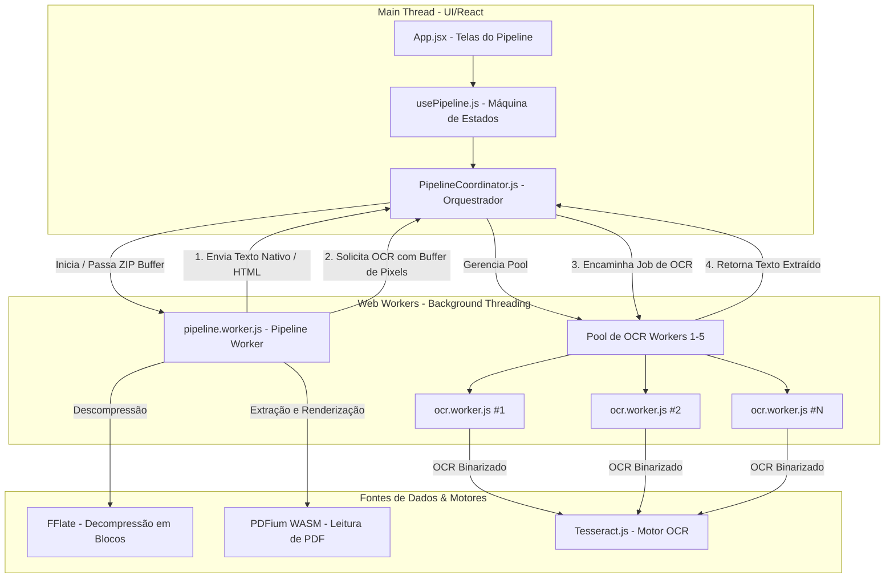

# Arquitetura do Sistema - eproc2txt 🏗️

Este documento descreve a arquitetura interna do `eproc2txt`, detalhando seu modelo multithreaded de Web Workers, o fluxo de dados, as estratégias de otimização de memória e o algoritmo de ordenação cronológica.

---

## 1. Visão Geral da Arquitetura

O `eproc2txt` é uma aplicação React de página única (SPA), puramente executada no cliente (browser-only), projetada para lidar com a extração paralela de grandes volumes de documentos jurídicos (como pacotes `.zip` de processos judiciais de mais de 500MB) sem travar a interface do usuário (Main Thread).

Para atingir essa performance sem comprometer a estabilidade do navegador, a aplicação separa as responsabilidades entre a Main Thread (UI e gerenciamento de estado de alto nível) e múltiplos Web Workers em segundo plano.

---

## 2. Divisão de Trabalho e Ciclo de Vida dos Workers

### 2.1 Main Thread (`App.jsx` + `usePipeline.js` + `PipelineCoordinator.js`)
- **React Components / Hooks:** Gerenciam os estados visuais (Configuração ➔ Processamento ➔ Conclusão) e renderizam os timers, progresso geral e status individual dos arquivos.
- **PipelineCoordinator:** É o cérebro orquestrador. Ele instancia os Web Workers, recebe mensagens do `PipelineWorker`, gerencia a fila de OCR, distribui tarefas de OCR para os `OCR Workers` disponíveis e constrói o XML consolidado final.

### 2.2 Pipeline Worker (`pipeline.worker.js`)
- Roda de forma isolada em uma thread própria de background.
- Recebe o buffer binário do arquivo ZIP e a lista de arquivos selecionados.
- Executa a descompressão sequencial por arquivo utilizando **FFlate** para evitar sobrecarga de memória.
- **Para arquivos HTML:** Realiza decodificação de encoding (UTF-8, Latin-1/ISO-8859-1 ou Windows-1252), sanitização de tags, remoção de scripts/styles e extração do texto corrido.
- **Para arquivos PDF:** Inicializa e manipula o motor **PDFium (WASM)**. Para cada página:
  1. Tenta extrair texto nativo selecionável.
  2. Se extraído com sucesso, repassa o texto diretamente para o `PipelineCoordinator`.
  3. Se a página for escaneada (sem texto válido), renderiza a página como um pixel buffer de alta resolução (escala 2.0x), realiza a binarização local (Otsu) e dispara uma requisição de OCR contendo o buffer de pixels transferível.

### 2.3 OCR Workers (`ocr.worker.js`)
- São instanciados de forma dinâmica pelo `PipelineCoordinator` (pool de 1 a 5 workers, conforme a capacidade da máquina ou escolha do usuário).
- Cada worker gerencia uma instância isolada do **Tesseract.js** configurada com o dicionário em português.
- Recebe o buffer de imagem binária (transferido via `ArrayBuffer` para evitar cópias de memória), reconstrói a imagem em um `OffscreenCanvas` em memória e executa o reconhecimento de caracteres (OCR).
- Devolve o texto extraído e o buffer de imagem de volta para a Main Thread.

---

## 3. Gerenciamento de Contra-Pressão (Backpressure)

Quando processos grandes contêm muitas páginas digitalizadas que necessitam de OCR, a geração de imagens de alta resolução pelo `Pipeline Worker` pode ser muito mais rápida do que o processamento do OCR pelo pool de `OCR Workers`. Isso acumularia centenas de megabytes de buffers de imagem em memória, resultando em travamento do navegador (Out Of Memory - OOM).

Para evitar isso, o `PipelineCoordinator` implementa um mecanismo de **contra-pressão**:

1. **Limite de Fila:** Se a fila de tarefas de OCR pendentes crescer além de `maxWorkers * 3` itens, o `PipelineCoordinator` envia um comando de `pause` para o `Pipeline Worker`.
2. **Pausa do Pipeline:** Ao receber a mensagem de pausa, o `Pipeline Worker` interrompe a leitura do arquivo ZIP e a renderização de novas páginas, permanecendo em um estado assíncrono bloqueado (`checkPause`).
3. **Retomada:** Uma vez que o pool de OCR limpa a fila e as tarefas pendentes caem abaixo de `maxWorkers * 1.5` itens, o `PipelineCoordinator` envia um comando de `resume` ao `Pipeline Worker`.
4. **Continuação:** O `Pipeline Worker` retoma o loop de páginas do PDF exatamente de onde parou.

---

## 4. Otimização e Gerenciamento de Memória

A aplicação adota práticas estritas de otimização de memória:
- **Buffers Transferíveis (Transferable Objects):** A imagem gerada pelo `PDFium` na thread do Pipeline é enviada ao Coordinator e consequentemente aos OCR Workers utilizando objetos transferíveis. A posse do `ArrayBuffer` é transferida entre threads sem realizar cópia em memória.
- **Desalocação Sequencial:** Os bytes descompactados de cada arquivo do ZIP no `Pipeline Worker` são explicitamente deletados do escopo (`delete unzipped[targetPath]`) logo após o processamento daquele arquivo.
- **Destruição Ativa de WASM:** Contextos de páginas e documentos abertos no PDFium.js têm seu método `.destroy()` chamado manualmente a cada ciclo de página e arquivo.
- **Descarte de Workers:** Ao final do processo, todos os workers são terminados (`terminate()`) e limpos para evitar vazamentos de memória e consumo residual de CPU.

---

## 5. Algoritmo de Ordenação e Consolidação

O processamento segue a ordenação cronológica/hierárquica estrita estipulada nas regras de negócio (implementado em `src/utils/parser.js`):

1. **Validação e Extração de Metadados:** Ao ler o ZIP, cada nome de arquivo passa por uma expressão regular para validar o formato: `Evento {número} - {tipo_documento}{numero_documento}.{extensão}`.
2. **Ordenação em Dois Níveis:**
   - **Nível 1:** Agrupamento e ordenação crescente pelo **Número do Evento** (Eventos `0` (Capa) até `N`). Arquivos fora do padrão são agrupados no final (evento `-1`).
   - **Nível 2:** Ordenação crescente pelo **Número do Documento** dentro de cada evento.
3. **Consolidação XML:** O XML final é gerado respeitando essa ordem cronológica precisa, garantindo que o texto extraído flua logicamente do início ao fim do processo judicial original.

---

## 6. Prevenção de Congelamento (Tab Freeze) e Suspensão

Como o pipeline processa arquivos executando Web Workers pesados no cliente, ele está sujeito às políticas de conservação de energia do sistema operacional e dos navegadores. Para mitigar esse risco de forma automática, a aplicação utiliza o módulo utilitário [wake-lock-audio.js](file:///c:/Users/jonyd/Projetos/eproc2txt/src/utils/wake-lock-audio.js):

1. **Prevenção de Suspensão do Computador (Screen Wake Lock API):**
   - Quando o processamento inicia, o coordenador solicita um lock do tipo `screen`. Isso sinaliza ao sistema operacional para manter a tela ativa e impedir a hibernação ou suspensão do computador.
2. **Prevenção de Congelamento da Aba (Silent Audio Playback via Web Audio API):**
   - Os navegadores Chromium/Webkit suspendem a execução de JavaScript (incluindo Web Workers) em abas que ficam inativas em segundo plano. Contudo, abas que reproduzem som são poupadas de suspensão para não quebrar a experiência de players de áudio.
   - O `eproc2txt` cria e reproduz um loop de silêncio absoluto em um `AudioContext` de volume zero durante toda a execução do pipeline. Isso impede que o navegador pause os Web Workers de processamento e OCR quando o usuário altera de aba.
3. **Ciclo de Vida Limpo:**
   - Ambos os bloqueios são solicitados no evento `startPipeline` (atendendo à exigência de gesto físico do usuário para habilitar áudio no browser) e são explicitamente liberados/encerrados ao concluir (`onFinished`), cancelar (`cancelPipeline`), reiniciar (`resetPipeline`) ou no desmonte (unmount) do hook principal.
